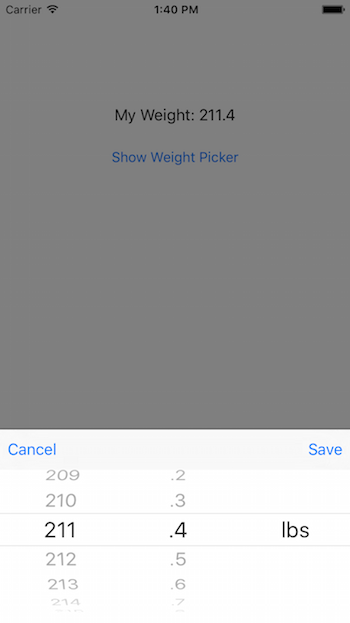

# BVDWeightPickerView
WeightPicker View for iOS that combines a UIPickerView with UIToolbar as a single view

BVDWeightPickerView comes preconfigured with weight values 80lbs to 300lbs

# Example

# Adding to View

<pre>
// make the view hidden by default
self.weightPicker.hidden = true

// add it as a subview
self.view.addSubview(self.weightPicker)

// add the automatic constraints
self.weightPicker.addConstraintsToSuperview(self.view)
</pre>

# Show Weight Picker

<pre>
// show our picker
self.weightPicker.show { (weight) -> Void in
    // success block
    self.lblWeight.text = "My Weight: \(weight)"
}
</pre>

